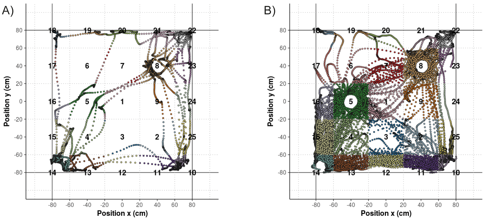

# ocd

This repository contains the most important scripts used for the analysis conducted by the first autor of the following paper: 

* Milou Straathof, Erwin L.A. Blezer, Caroline van Heijningen, Christel E. Smeele, Annette van der Toorn, TACTICS Consortium, Jan K. Buitelaar, Jeffrey C. Glennon, Willem M. Otte and Rick M. Dijkhuizen, "Structural and functional MRI of altered brain development in a novel adolescent rat model of quinpirole-induced compulsive checking behavior", under review.

## Study background

In this study we developed an adolescent rat model of compulsive checking behavior and investigated developmental changes in structural and functional measures in the frontostriatal circuitry. Five-weeks old Sprague Dawley rats were subcutaneously injected with quinpirole or saline twice a week for five weeks. Each injection was followed by placement in the middle of an open field table, and compulsive behavior was quantified as repeated checking behavior. Anatomical, resting-state functional and diffusion MRI at 4.7T were conducted before the first and after the last quinpirole/saline injection to measure regional volumes, functional connectivity and structural integrity in the brain, respectively. 
 
### Behavioral acquisition

Juvenile Sprague Dawley rats were subcutaneously injected rats with quinpirole or saline. Each injection was followed by placement of the rat in the middle of a large open field table for 30 minutes. On the open field table (160×160 cm2, 60 cm above the floor), four objects (two black, two white; 8×8×8 cm3) were placed on fixed locations: two near the middle and two near the corners of the open field. Each rat’s activity on the open field table was recorded with a camera fixed to the ceiling. 

Ethovision software (Noldus Information Technology B.V., Netherlands) was used to automatically trace the trajectories of locomotion for the open field tests after the fifth and tenth quinpirole/saline injection. The open field area was virtually divided into 25 rectangles of 40×40 cm2 of which the outer zones extended outside the open field. 

### Behavioral analysis

The scripts provide means to determine the locomotor behavior during this observation period.

Compulsive checking behavior parameters were characterized relative to the home-base, and included frequency of checking (the total number of visits at the home-base), length of checks (the average time of a visit at the home-base), recurrence time of checking (the average time spent at other areas before returning to the home-base) and stops before returning to the home-base (the average number of areas an animal visited before returning to the home-base). 

In addition, we determined the predictability of the visited zones as the Lempel-Ziv source entropy [Song et al., 2010](https://doi.org/10.1126/science.1177170) using a maximal substring of three zones and only including animals that visited at least nine different zones. The higher the source entropy, the less predictable the locomotion. 

Besides the compulsive behavior, we calculated hyperactivity measures, including the total travelled distance, average velocity of movement and immobility time (<0.01 cm movement per video frame). 

Locomotor trajectory of a control (A) and a quinpirole-injected adolescent rat (B) during the open field test. The different zones of the open field are numbered, and the locomotor trajectories are colored corresponding to these zones. 

### Resting-state functional MRI
MRI scripts rely on [FSL](https://fsl.fmrib.ox.ac.uk/fsl/fslwiki) and [AFNI](https://afni.nimh.nih.gov) programs as well as customized C++-programs.
Source code for these customized programs is provided [here](https://github.com/wmotte/toolkid/).
Binaries – compiled on a Ubuntu 64bit server – are [available](bin/) as well.

Preprocessing steps of the MRI scans included removal of the first 20 images to reach a steady state; motion-correction with MCFLIRT; and brain-extraction with BET. Motion-correction parameters were used as regressor for the resting-state signal, and low-frequency blood oxygenation level-dependent fluctuations were obtained by applying temporal filtering between 0.01 and 0.1 Hz in AFNI. Correlations were Fisher’s Z-transformed.

## License

This project is licensed - see the [LICENSE](LICENSE) file for details 
 
